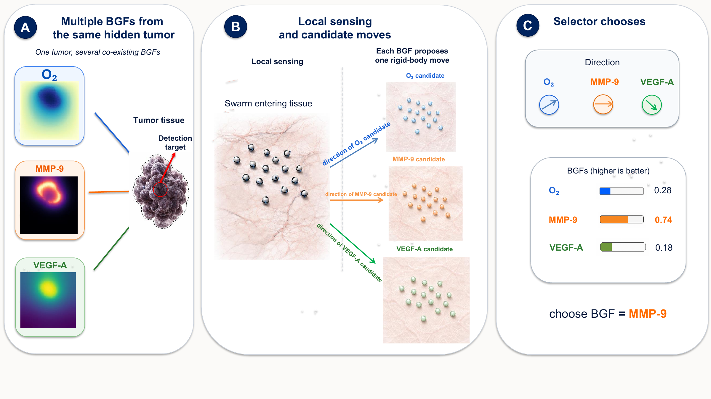

# Swarm-Relative Biological Gradient Field Selection



This repository contains the code used for the main BGF selector experiments in magnetic nanorobot tumor targeting. It includes the selector, the PhysiCell project files, and the scripts needed to regenerate instances, train the selector, and evaluate it.

## Project Structure

```text
.
├── README.md
├── LICENSE
├── requirements.txt
├── pyproject.toml
├── fig_pipeline.pdf
├── fig_pipeline.png
├── miso/
│   ├── __init__.py
│   ├── physicell_gen.py                 # randomized PhysiCell instance generator
│   ├── physicell_oracle.py              # noisy point-query wrapper around cached fields
│   └── selector_swarm.py                # swarm dynamics, BGF selector, and evaluation environment
├── physicell/
│   └── miso_biomarker_fields/           # custom PhysiCell user project
│       ├── Makefile
│       ├── VERSION.txt
│       ├── main.cpp
│       ├── config/
│       │   ├── PhysiCell_settings.xml
│       │   ├── PhysiCell_settings_probe.xml
│       │   ├── PhysiCell_settings_smoke.xml
│       │   ├── cells.csv
│       │   └── smoke.xml
│       └── custom_modules/
│           ├── custom.cpp
│           └── custom.h
└── scripts/
    ├── physicell/
    │   ├── setup_physicell_project.sh   # fetch/build PhysiCell with our user project
    │   ├── run_instance.sh              # run one generated instance
    │   ├── run_manifest.sh              # run a manifest with local parallel workers
    │   └── cache_fields.py              # pack completed simulations into cache.npz
    ├── training/
    │   ├── gen_advantage_data.py
    │   ├── gen_advantage_shards.sh
    │   └── train_selector.py
    ├── evaluation/
    │   ├── eval_selector.py
    │   └── summarize_eval.py
    └── validation/
        ├── validate_fields.py
        └── validate_growth_fields.py
```

## Setup

You need Python 3.10+, `git`, `make`, and a C++ compiler with OpenMP support. CPU PyTorch is enough for data generation and evaluation; GPU PyTorch is helpful for training.

```bash
git clone https://github.com/ZHAOYANG0705/ci-bgf-selector.git
cd ci-bgf-selector

python -m venv .venv
source .venv/bin/activate
pip install --upgrade pip
pip install -r requirements.txt
pip install -e .
```

PhysiCell is an external simulator, so the full upstream source is not copied into this repository. The setup script downloads a tested PhysiCell snapshot, loads `physicell/miso_biomarker_fields`, and builds the executable:

```bash
bash scripts/physicell/setup_physicell_project.sh
```

If you already have a PhysiCell checkout:

```bash
bash scripts/physicell/setup_physicell_project.sh /path/to/PhysiCell
export PHYSICELL_DIR=/path/to/PhysiCell
```

If your compiler is not `g++`, set it first:

```bash
export PHYSICELL_CPP=/path/to/c++
```

## Smoke Test

Run this once before starting the full experiment. It checks that Python, PhysiCell, the generated XML, simulation output, and cache loading all agree.

```bash
SMOKE_ROOT="$PWD/data/smoke"
python -m miso.physicell_gen --split test --n 1 --root "$SMOKE_ROOT" --max_time 60
bash scripts/physicell/run_instance.sh "$SMOKE_ROOT/test/manifest.txt" 0
python scripts/physicell/cache_fields.py --root "$SMOKE_ROOT" --split test
python scripts/validation/validate_fields.py "$SMOKE_ROOT/test"
```

## Main Experiment

Generate the PhysiCell instances:

```bash
DATA_ROOT="$PWD/data/instances"
python -m miso.physicell_gen --split train --n 1500 --root "$DATA_ROOT"
python -m miso.physicell_gen --split val   --n 250  --root "$DATA_ROOT"
python -m miso.physicell_gen --split test  --n 250  --root "$DATA_ROOT"
```

Run the simulations. Adjust `JOBS` to your machine.

```bash
JOBS=8 bash scripts/physicell/run_manifest.sh "$DATA_ROOT/train/manifest.txt" 1500
JOBS=8 bash scripts/physicell/run_manifest.sh "$DATA_ROOT/val/manifest.txt" 250
JOBS=8 bash scripts/physicell/run_manifest.sh "$DATA_ROOT/test/manifest.txt" 250
```

Cache the completed fields:

```bash
python scripts/physicell/cache_fields.py --root "$DATA_ROOT" --split train
python scripts/physicell/cache_fields.py --root "$DATA_ROOT" --split val
python scripts/physicell/cache_fields.py --root "$DATA_ROOT" --split test
```

Build the selector training shards:

```bash
JOBS=8 bash scripts/training/gen_advantage_shards.sh "$DATA_ROOT" train shards 1500 25
```

Train and evaluate five seeds:

```bash
mkdir -p runs
for seed in 0 1 2 3 4; do
  python scripts/training/train_selector.py \
    --shards "shards/adv_*.npz" \
    --mode rel --epochs 40 --seed "$seed" \
    --out "runs/selector_rel_s${seed}.pth"

  python scripts/evaluation/eval_selector.py \
    --root "$DATA_ROOT" --split test \
    --selector "runs/selector_rel_s${seed}.pth" --mode rel \
    --start 0 --end 250 --trials 8 --radius 60 \
    --policies random,fusion,learned \
    --out "runs/main_s${seed}.json"
done

python scripts/evaluation/summarize_eval.py "runs/main_s*.json"
```

## Free-Growth Check

This is optional. It uses the same pipeline, but the tumors start from a small seed and grow before the fields are cached.

```bash
GROW_ROOT="$PWD/data/instances_growth"
python -m miso.physicell_gen --split test --n 40 --root "$GROW_ROOT" --growth --max_time 1440
JOBS=8 bash scripts/physicell/run_manifest.sh "$GROW_ROOT/test/manifest.txt" 40
python scripts/physicell/cache_fields.py --root "$GROW_ROOT" --split test
python scripts/validation/validate_growth_fields.py "$GROW_ROOT/test"

python scripts/evaluation/eval_selector.py \
  --root "$GROW_ROOT" --split test \
  --selector runs/selector_rel_s0.pth --mode rel \
  --start 0 --end 40 --trials 8 --radius 60 \
  --policies random,fusion,learned \
  --out runs/growth_s0.json
```
